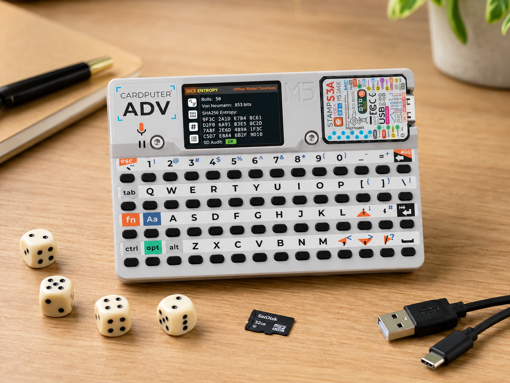

# Solana Dice BIP39 Wallet Generator ESP32 — Cardputer ADV



Launcher-ready PlatformIO firmware for M5Stack Cardputer/Cardputer ADV.

Current release is a dice entropy / BIP39 precursor firmware, not a complete wallet generator yet.

## Current scope

- colorful 240x135 Cardputer ADV UI
- physical d6 input uses a strict press-release FSM: one complete keypress = one roll; dice-key chords are ignored
- Von Neumann extraction from roll pairs:
  - equal pair: discarded
  - first < second: bit 0
  - first > second: bit 1
- hard gate: at least 256 accepted VN bits
- no fixed roll-count gate; fair d6 usually needs about 615 rolls, but actual VN bit count wins
- SHA-256 audit fingerprint display, split into large readable numbered lines
- result pages for fingerprint, BIP39 passphrase warning, Solflare/Phantom path notes, mnemonic status, sanity checks, and SD audit
- SD report at `/dice_wallet/report.txt` when available
- startup disables Wi-Fi and Bluetooth; `RADIOS OFF` is shown only when the firmware sees radios disabled

## Not implemented yet

- BIP39 mnemonic generation
- BIP39 passphrase input / NFKD normalization
- SLIP-0010 Ed25519 derivation
- Solana address derivation
- private-key export

Do not use this firmware for real-money wallet generation yet.

## Crypto contract

The intended future contract is:

```text
physical d6 rolls
→ Von Neumann extraction
→ rawEntropy[32]
→ BIP39 ENT
```

The displayed SHA-256 value is an audit fingerprint only:

```text
SHA256("DiceWallet audit v1" || rawEntropy[32])
```

The SD report must not store raw rolls, raw entropy, mnemonic, passphrase, seed, or private keys. Runtime roll storage uses a fixed buffer that is overwritten on clear/delete instead of Arduino `String`.

## Controls

- `1`..`6`: enter die roll
- `Enter`: validate and create audit fingerprint after 256 VN bits
- Up/Left or `W/A`: previous result page
- Down/Right or `S/D`: next result page
- `Del` on input page: remove last roll
- `Del` on result page: arm modal clear-all confirmation
- `Y`: confirm clear-all
- `N`: cancel clear-all
- while clear is armed, all other input is ignored

## Build

```bash
python -m platformio run
```

Output:

```text
.pio/build/cardputer_adv_launcher/firmware.bin
```

Release binary name:

```text
DiceWallet-cardputer-adv.bin
```

## Run via Launcher

1. Install M5Launcher/Cardputer ADV Launcher on device.
2. Copy `DiceWallet-cardputer-adv.bin` to FAT32 SD card or upload via Launcher WebUI.
3. Launcher → SD/WUI → select binary → install.
4. Reboot.

## Target

`platformio.ini` pins:

- `espressif32@6.4.0`
- `M5Cardputer@1.1.1`
- `M5Unified@0.2.20`
- `M5GFX@0.2.27`
- `IRremote@4.7.1`

The project uses `esp32-s3-devkitc-1` because Cardputer ADV support is provided by the M5Cardputer Arduino library.

## Release integrity

CI builds firmware artifacts on every push. For version tags, GitHub Actions publishes release assets directly from the CI-built `.pio/build/cardputer_adv_launcher/firmware.bin` plus `DiceWallet-cardputer-adv.bin.sha256`. Local committed binaries are convenience artifacts, not the root of trust.
